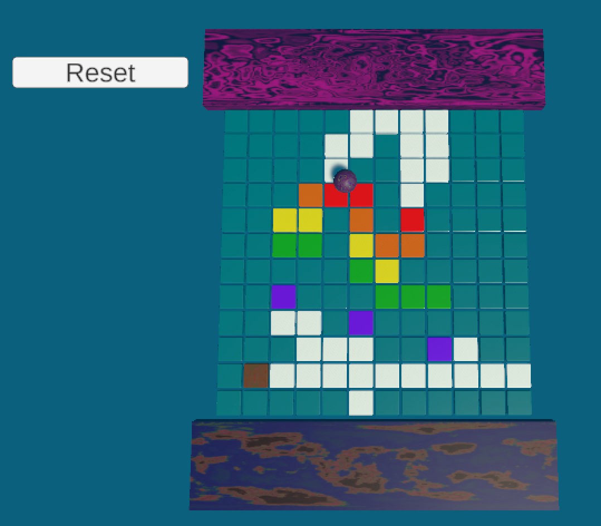

Create a new `Reset` script on the ball:

--- code ---
---
language: cs 
filename: Reset.cs 
line_numbers: true 
line_number_start: 1 
line_highlights: 
---

using System.Collections;
using System.Collections.Generic;
using UnityEngine;
using UnityEngine.SceneManagement;
public class Reset : MonoBehaviour
{

    // Start is called before the first frame update
    void Start()
    {

    }

    // Update is called once per frame
    void Update()
    {

    }

    public void resetAll()
    {
        SceneManager.LoadScene(SceneManager.GetActiveScene().name);
    }
}

--- /code ---

Go to the Hierarchy window and click on the ‘Button’ GameObject.

In the Inspector window, scroll down until you see the ‘On Click()’ component.

Click on the the + sign to create a new action.

Drag the ‘Ball’ GameObject from the Hierarchy window to the Object property of the action.

Click on the function property and select Reset > resetAll() to call the resetAll method from your Reset script.

